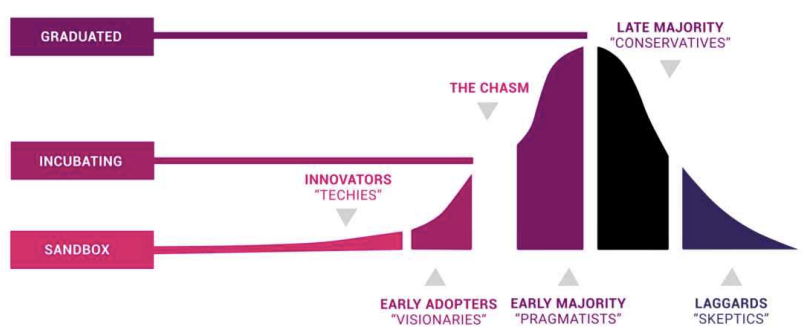
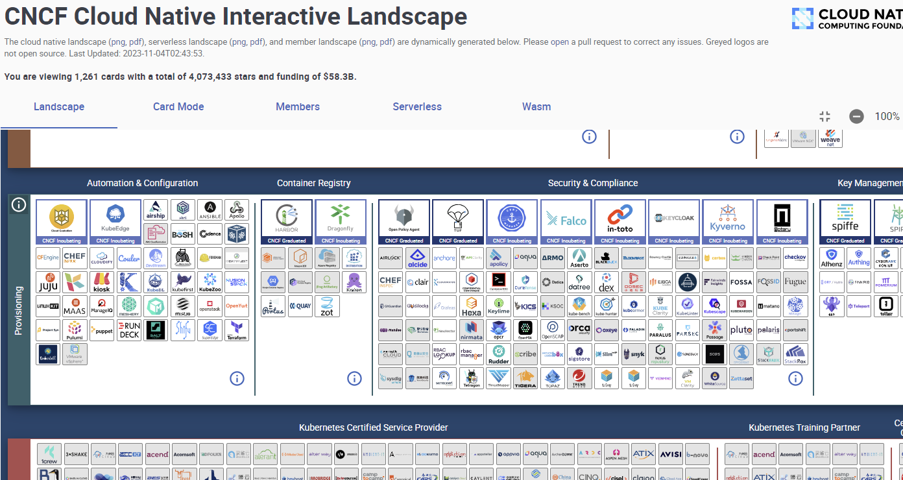

---
sidebar:
  nav: "tech"
---

## CNCF

  - 배경

      클라우드 네이티브 컴퓨팅 재단(CNCF: Cloud Native Computing Foundation)으로
      클라우드 관련 산업에 도움을 주기 위해 리눅스 재단의 프로젝트로 2015년에 설립되었다.  
      구글(Google)이 핵심 창립 멤버로 쿠버테티스 버전 발표로 처음 기여하는 것으로 시작하여
      지금은 소프트웨어/하드웨어 공급자, 컨설팅 및 서비스 600개 회원 참여, 학교, 비영리 단체 등 포함 하여 
      총 800여개 이상의 회원 단체가 있다. 

  - 성숙도

      CNCF의 목적 중 클라우드 네이티브 컴퓨팅 생태계를 위해 프로젝트를 지원 및 육성이 가장 큰 목표

          

      CNCF 기술 감독 위원회(TOC: Technical Oversight Committee)의 투표로 성숙도 결정  
      얼리 어답터가 채택하고 있지만 아직 ‘캐즘’을 넘지 못한 ‘샌드박스 단계’,    
      캐즘을 넘어 본격적으로 초기 주류가 채택하는 ‘인큐베이팅’ 단계, 대다수 주류가 채택하게 되는 ‘졸업’ 단계

  - 프로젝트 현황
    
          

      CNCF에서 커버하는 영역은 애플리케이션, 데브옵스(DevOps), 컨테이너 오케스트레이션 및 관리, 
      서비스 프로비저닝(Provisioning), 모니터링 및 분석 도구 등 소프트웨어 전주기에 해당. 
  